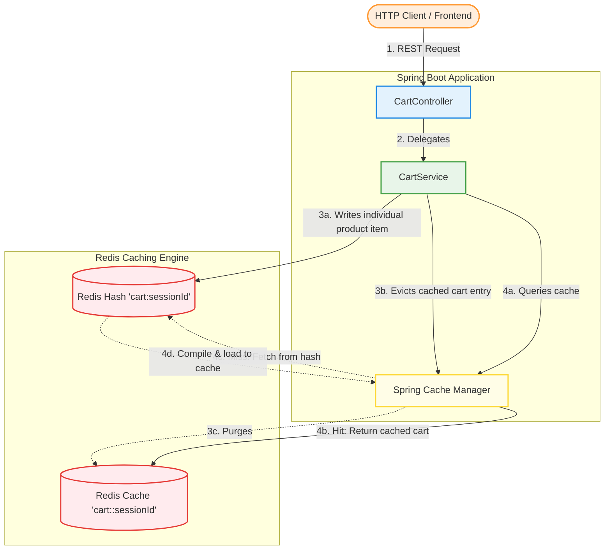
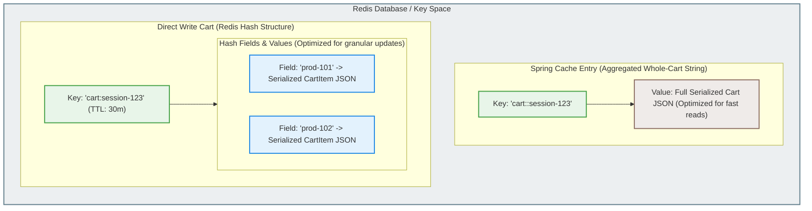

# 🛒 Distributed Shopping Cart Service with Redis Caching

[](https://spring.io/projects/spring-boot)
[](https://openjdk.org/projects/jdk/21/)
[](https://redis.io/)
[](https://www.docker.com/)
[](https://projectlombok.org/)

A highly scalable, production-ready Distributed Shopping Cart Microservice built with **Spring Boot 4.x**, **Redis**, and **Docker**. 

This service implements a **hybrid caching design** to handle high-frequency writes and fast, consistent reads. It features transient session cart storage, sliding TTL expirations, robust input validation, resilient failover mechanisms, and telemetry monitoring with **Spring Boot Actuator**, **Micrometer**, and **Redis Commander**.

---

## 🏗️ Architecture & High-End Design Decisions

To achieve both **ultra-high-speed performance for updates** and **maximum efficiency for reads**, this system separates the write-path from the read-path using a customized hybrid storage model.

### 1. Hybrid Caching & Redis Data Structures

Instead of serializing and writing the entire cart object on every minor change (which creates race conditions and heavy network payloads), we partition operations:

* **Write-Path (Fine-Grained Updates via Redis Hashes)**:
  Carts are represented in Redis as a Hash key (`cart:{sessionId}`). Individual cart items are stored inside that hash, indexed by `productId` as the field key, and a serialized `CartItem` JSON as the field value.
  * When a user changes the quantity of a single product or deletes one product, we execute a direct Hash update (`opsForHash().put()` or `delete()`).
  * Only a single item is serialized/deserialized and transmitted over the network.
  * This eliminates the standard read-modify-write race conditions in high-throughput settings.

* **Read-Path (Aggregated Caching via Spring Cache)**:
  Retrieving the entire cart occurs frequently during browsing and checkout. To avoid reconstructing the cart dynamically on every single page load:
  * We layer **Spring Cache** directly on top of cart retrieval, using the cache key `cart::#{sessionId}`.
  * **Cache Miss**: The service queries the Redis Hash `cart:{sessionId}`, retrieves all fields, aggregates the items, calculates the `totalAmount` and unique `itemCount` on-the-fly, saves the fully-assembled `Cart` inside Spring Cache (`cart::#{sessionId}`), and returns it to the client.
  * **Cache Hit**: Subsequent reads fetch the aggregated `Cart` directly from the Spring cache string, returning it in sub-millisecond time.
  * **Cache Eviction**: Every modification write (adding, updating, or deleting items) automatically evicts the cached `Cart` from the Spring Cache, ensuring clients never receive stale cart totals.

* **Micrometer Cache Telemetry**:
  The custom `RedisCacheManager` is configured with statistics enabled. Cache retrievals register hits and misses to **Micrometer's `MeterRegistry`**, exposing live caching hit-rates via Actuator metrics and the custom `/api/cart/cache-stats` endpoint.

---

## 📊 System Workflows & Storage Layouts

### Service Interaction Flowchart

Below is the lifecycle of client REST requests as they interact with the Spring Boot application layer and Redis cache databases.



---

### Redis Physical Key Space Storage Layout

Here is how data is structured internally inside Redis. Notice the distinction between the Spring Cache key (Simple String storing aggregated JSON) and the Direct Write Cart key (Redis Hash storing product fields).



---

## ⚡ Key Caching Strategies & Resiliency

### 2. Time-To-Live (TTL) & Sliding Expiration
To prevent Redis memory saturation from orphaned or abandoned carts, a sliding Time-To-Live (TTL) of **30 minutes (1800 seconds)** is active.
* Every operation that modifies a cart (adding/updating quantities or removing items) executes an atomic `redisTemplate.expire()` operation.
* This resets the TTL back to 30 minutes, keeping active shopper sessions alive while automatically removing dormant carts.

### 3. Graceful Outage Handlers & Resiliency
If a database partition occurs or the Redis cache server goes offline, standard Spring Boot applications will throw exceptions and fail. 
* Our **`GlobalExceptionHandler`** intercepts `RedisConnectionFailureException` and `RedisSystemException`.
* The system gracefully falls back and returns a clean, detailed **`53 Service Unavailable`** response.
* Standardized validation intercepts bad client payloads (e.g. quantity must be greater than zero, valid price bounds), converting exceptions to detailed, field-specific **`400 Bad Request`** validation arrays.

---

## 📂 Project Directory Structure

```
Distributed-Shopping-Cart-Service-with-RedisCaching/
├── .mvn/                                     # Maven Wrapper binary components
├── src/
│   ├── main/
│   │   ├── java/com/CartService/
│   │   │   ├── config/
│   │   │   │   └── RedisConfig.java          # Redis Templates, JSON Serializers, & Cache Config
│   │   │   ├── controller/
│   │   │   │   └── CartController.java       # Exposes standard REST endpoints
│   │   │   ├── exception/
│   │   │   │   └── GlobalExceptionHandler.java # Formats Redis failure and validation errors
│   │   │   ├── model/
│   │   │   │   ├── Cart.java                 # Aggregated Cart with dynamic total calculations
│   │   │   │   └── CartItem.java             # Individual products with JSR-380 validation labels
│   │   │   ├── service/
│   │   │   │   └── CartService.java          # Orchestrates direct writes, cache lookups & stats
│   │   │   └── DistributedShoppingCartServiceWithRedisCachingApplication.java # Entry Point
│   │   └── resources/
│   │       └── application.properties        # Application ports, telemetry configs & env defaults
│   └── test/                                 # Embedded JUnit Integration Testing suites
├── Dockerfile                                # Multi-stage build compilation & execution
├── docker-compose.yml                        # Instantiates App, Redis, and GUI container stack
├── pom.xml                                   # Spring Boot dependency manifests (Micrometer, Actuator)
└── README.md                                 # This Document
```

---

## 🔌 API Endpoints Reference

### 1. Add / Update Cart Item
Adds a new item or sums the quantity of an existing item in the session's shopping cart. Evicts the read cache.
* **Method**: `POST`
* **Path**: `/api/cart/{sessionId}/items`
* **Headers**: `Content-Type: application/json`
* **Request Payload**:
  ```json
  {
    "productId": "prod-101",
    "productName": "Wireless Mechanical Keyboard",
    "price": 89.99,
    "quantity": 2
  }
  ```
* **Response (201 Created)**:
  ```json
  {
    "sessionId": "session-123",
    "items": [
      {
        "productId": "prod-101",
        "productName": "Wireless Mechanical Keyboard",
        "price": 89.99,
        "quantity": 2
      }
    ],
    "totalAmount": 179.98,
    "itemCount": 1
  }
  ```

### 2. Retrieve Shopping Cart
Retrieves the complete state of the cart. Leverages high-speed Spring caching.
* **Method**: `GET`
* **Path**: `/api/cart/{sessionId}`
* **Response (200 OK)**:
  ```json
  {
    "sessionId": "session-123",
    "items": [
      {
        "productId": "prod-101",
        "productName": "Wireless Mechanical Keyboard",
        "price": 89.99,
        "quantity": 2
      }
    ],
    "totalAmount": 179.98,
    "itemCount": 1
  }
  ```

### 3. Remove Single Cart Item
Removes a specific product from the cart session. Resets sliding TTL and evicts cache.
* **Method**: `DELETE`
* **Path**: `/api/cart/{sessionId}/items/{productId}`
* **Response (200 OK)**:
  ```json
  {
    "sessionId": "session-123",
    "items": [],
    "totalAmount": 0.0,
    "itemCount": 0
  }
  ```

### 4. Clear Shopping Cart
Deletes the entire cart session from the Redis Hash and evicts the Spring Cache.
* **Method**: `DELETE`
* **Path**: `/api/cart/{sessionId}`
* **Response (200 OK)**:
  *(Empty Response Body)*

### 5. Retrieve Cache Statistics
Exposes current live statistics and performance values.
* **Method**: `GET`
* **Path**: `/api/cart/cache-stats`
* **Response (200 OK)**:
  ```json
  {
    "totalCarts": 1,
    "hitRate": 0.75
  }
  ```

---

## 🚀 Setup & Launch Guide

You can run this project either via a fully containerized environment or locally on your development system.

### System Requirements
* [Docker Desktop](https://www.docker.com/) and [Docker Compose](https://docs.docker.com/compose/) (Highly Recommended)
* [Java 21 JDK](https://adoptium.net/temurin/releases/?version=21) (For local non-containerized setups)
* [Maven 3.8+](https://maven.apache.org/) (If running locally without Maven wrapper)

---

### 📦 Option A: Running via Docker Compose (Recommended - Quick Start)

This setup launches the entire stack inside an isolated container network. Our multi-stage `Dockerfile` compiles the code inside a virtual environment—**meaning you do not even need Java or Maven installed on your host system to run the application.**

1. **Verify your environment parameters**:
   The configuration is driven by standard environment variables. You can customize the environment configuration by creating a `.env` file in the project root:
   ```properties
   SPRING_REDIS_HOST=redis
   SPRING_REDIS_PORT=6379
   ```

2. **Boot the Docker Container Stack**:
   From your terminal (Command Prompt, PowerShell, or Git Bash), run:
   ```bash
   docker-compose up --build
   ```

3. **Enjoy Service Integration**:
   Once the containers report healthy states, the services are bound to the following addresses:
   * **Spring Boot REST API**: `http://localhost:8080`
   * **Actuator Health Portal**: `http://localhost:8080/actuator/health`
   * **Redis Commander Web GUI**: `http://localhost:8081`

> [!TIP]
> **Using Redis Commander GUI**: Open [http://localhost:8081](http://localhost:8081) in your browser. This web app displays your live Redis database. As you run API calls, watch `cart:sessionId` Hashes and `cart::sessionId` Strings get created, altered, and removed in real time!

---

### 💻 Option B: Running Locally (For Active Development)

If you are writing code or making modifications, run a local Redis container and run the Spring Boot app on your host machine:

1. **Spin up a local Redis container**:
   ```bash
   docker run -d --name local-redis -p 6379:6379 redis:7-alpine
   ```

2. **Launch the Spring Boot Application**:
   * **On Windows (PowerShell/CMD)**:
     ```powershell
     .\mvnw spring-boot:run
     ```
   * **On Unix/macOS/Linux**:
     ```bash
     ./mvnw spring-boot:run
     ```

3. The application will start locally at `http://localhost:8080`.

---

## 🧪 Interactive Validation Walkthrough

Test your distributed caching system. You can execute these commands in your standard terminal. We provide **cURL** (Bash) and native **Windows PowerShell** (`Invoke-RestMethod`) configurations for each operation.

### Step 1: Query Actuator System Health
Make sure all microservice subsystems are online.
* **cURL**:
  ```bash
  curl http://localhost:8080/actuator/health
  ```
* **PowerShell**:
  ```powershell
  Invoke-RestMethod -Uri "http://localhost:8080/actuator/health" | ConvertTo-Json
  ```

---

### Step 2: Add Product Item (Session Initialization)
Add a Mechanical Keyboard (quantity 2) to initialize the cart `session-user-99`.
* **cURL**:
  ```bash
  curl -X POST http://localhost:8080/api/cart/session-user-99/items \
    -H "Content-Type: application/json" \
    -d '{"productId":"prod-101","productName":"Wireless Mechanical Keyboard","price":89.99,"quantity":2}'
  ```
* **PowerShell**:
  ```powershell
  $body = @{
      productId = "prod-101"
      productName = "Wireless Mechanical Keyboard"
      price = 89.99
      quantity = 2
  } | ConvertTo-Json
  
  Invoke-RestMethod -Uri "http://localhost:8080/api/cart/session-user-99/items" -Method Post -ContentType "application/json" -Body $body | ConvertTo-Json
  ```

---

### Step 3: Add Another Product (Verify Aggregation)
Add an MX Master Mouse (quantity 1) to the same session.
* **cURL**:
  ```bash
  curl -X POST http://localhost:8080/api/cart/session-user-99/items \
    -H "Content-Type: application/json" \
    -d '{"productId":"prod-102","productName":"MX Master Productivity Mouse","price":99.50,"quantity":1}'
  ```
* **PowerShell**:
  ```powershell
  $body = @{
      productId = "prod-102"
      productName = "MX Master Productivity Mouse"
      price = 99.50
      quantity = 1
  } | ConvertTo-Json
  
  Invoke-RestMethod -Uri "http://localhost:8080/api/cart/session-user-99/items" -Method Post -ContentType "application/json" -Body $body | ConvertTo-Json
  ```

---

### Step 4: Retrieve the Cart (Triggers Caching)
Get the full cart layout. The first request retrieves it from the Redis Hash and loads it into the Spring Cache. Subsequent requests return the cached values in sub-milliseconds.
* **cURL**:
  ```bash
  curl http://localhost:8080/api/cart/session-user-99
  ```
* **PowerShell**:
  ```powershell
  Invoke-RestMethod -Uri "http://localhost:8080/api/cart/session-user-99" | ConvertTo-Json
  ```

---

### Step 5: Query Live Cache Telemetry
Inspect how many carts are stored in Redis and view the hit rate. Perform the retrieval endpoint multiple times before checking statistics to witness the hit-rate increase towards `1.0`.
* **cURL**:
  ```bash
  curl http://localhost:8080/api/cart/cache-stats
  ```
* **PowerShell**:
  ```powershell
  Invoke-RestMethod -Uri "http://localhost:8080/api/cart/cache-stats" | ConvertTo-Json
  ```

---

### Step 6: Negative Testing (Verify Input Constraints)
Send a malformed payload (quantity `0`) to confirm JSR-380 verification and custom global exception validation work.
* **cURL**:
  ```bash
  curl -i -X POST http://localhost:8080/api/cart/session-user-99/items \
    -H "Content-Type: application/json" \
    -d '{"productId":"prod-101","productName":"Wireless Mechanical Keyboard","price":89.99,"quantity":0}'
  ```
* **PowerShell**:
  ```powershell
  $body = @{
      productId = "prod-101"
      productName = "Wireless Mechanical Keyboard"
      price = 89.99
      quantity = 0
  } | ConvertTo-Json
  
  # SkipHttpErrorCheck is used to print the 400 Bad Request response body
  Invoke-WebRequest -Uri "http://localhost:8080/api/cart/session-user-99/items" -Method Post -ContentType "application/json" -Body $body -SkipHttpErrorCheck | Select-Object -ExpandProperty Content
  ```

---

### Step 7: Delete Single Product
Delete the Mechanical Keyboard (`prod-101`) and observe total amounts automatically adjust.
* **cURL**:
  ```bash
  curl -X DELETE http://localhost:8080/api/cart/session-user-99/items/prod-101
  ```
* **PowerShell**:
  ```powershell
  Invoke-RestMethod -Uri "http://localhost:8080/api/cart/session-user-99/items/prod-101" -Method Delete | ConvertTo-Json
  ```

---

### Step 8: Clear Shopping Cart
Remove the cart completely, deleting all corresponding Redis database references and cache items.
* **cURL**:
  ```bash
  curl -i -X DELETE http://localhost:8080/api/cart/session-user-99
  ```
* **PowerShell**:
  ```powershell
  Invoke-WebRequest -Uri "http://localhost:8080/api/cart/session-user-99" -Method Delete | Select-Object StatusCode, StatusDescription
  ```

---

## ⚡ Design Patterns & Production Best Practices

* **JSON Serialization Over Binary**:
  Instead of utilizing Java's default native binary serialization (which is unreadable outside of Java and susceptible to deserialization vulnerabilities), both `RedisTemplate` and `RedisCacheManager` are configured with a custom `GenericJackson2JsonRedisSerializer`. Keys and Hash Keys utilize string representations, whereas Values and Hash Values use readable, interoperable JSON formats.
* **Aggressive Thread Isolation**:
  The microservice is stateless, allowing it to scale behind a standard load balancer. The data integrity is maintained at the Redis tier.
* **Robust Spring profiles**:
  By utilizing `${SPRING_REDIS_HOST:localhost}` fallback notation in `application.properties`, the application runs seamlessly out-of-the-box in local IDE configurations, local Docker, and distributed Kubernetes deployments.
