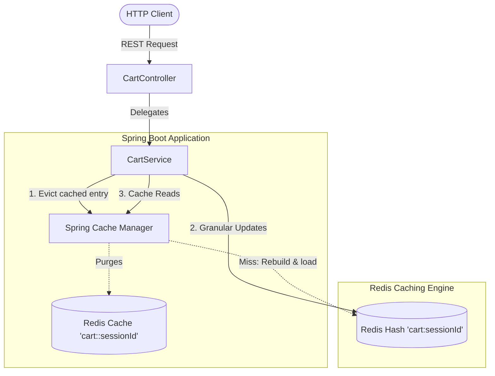

# 🛒 Distributed Shopping Cart Service with Redis Caching

[](https://spring.io/projects/spring-boot)
[](https://openjdk.org/projects/jdk/21/)
[](https://redis.io/)
[](https://www.docker.com/)

A high-performance, production-ready Distributed Shopping Cart Microservice built with **Spring Boot 4.x**, **Redis**, and **Docker**. It implements a hybrid caching architecture designed for high-frequency writes and sub-millisecond consistent reads.

---

## 🏗️ Architecture & High-End Design

To handle extreme write-concurrency while maintaining blazing-fast read access, the system separates write and read pathways:

* **Write-Path (Granular Redis Hashes)**: Carts are stored as Redis Hashes (`cart:{sessionId}`). Operations like adding, updating, or deleting individual products modify only the specific hash field (`productId` -> `CartItem` JSON) to eliminate race conditions and avoid heavy serialization overhead.
* **Read-Path (Spring Cache Integration)**: Retrieving the entire cart leverages **Spring Cache** (`cart::#{sessionId}`) for sub-millisecond responses. Any write operation automatically evicts the cache entry, ensuring total consistency.
* **Sliding TTL (30 Mins)**: Automatic sliding expiration resets on every cart modification to prevent Redis memory saturation from orphaned carts.
* **Resiliency**: Fully intercepts database outages gracefully, returning clean, field-specific validation arrays (`400 Bad Request`) or generic service failure responses (`503 Service Unavailable`).



---

## 🔌 API Endpoints Reference

### Cart Operations

| Endpoint | Method | Description | Sample Payload / Params |
| :--- | :---: | :--- | :--- |
| `/api/cart/{sessionId}/items` | `POST` | Add/Update Cart Item (Evicts Cache) | `{"productId":"prod-101", "productName":"Keyboard", "price":89.99, "quantity":2}` |
| `/api/cart/{sessionId}` | `GET` | Retrieve Full Cart (Uses Spring Cache) | *None* |
| `/api/cart/{sessionId}/items/{productId}` | `DELETE` | Remove Single Item from Cart | *None* |
| `/api/cart/{sessionId}` | `DELETE` | Clear Entire Cart Session | *None* |
| `/api/cart/cache-stats` | `GET` | Retrieve Live Cache Telemetry | *None* |

---

## 📂 Project Directory Structure

```text
Distributed-Shopping-Cart-Service-with-RedisCaching/
├── src/main/java/com/CartService/
│   ├── config/RedisConfig.java      # Redis Templates & Cache Configuration
│   ├── controller/CartController.java # REST Endpoints
│   ├── exception/GlobalExceptionHandler.java # Custom Redis Outage & Validation Handler
│   ├── model/                       # Data entities (Cart, CartItem) with JSR-380 Validation
│   └── service/CartService.java      # Caching Orchestrator & Stats Tracker
├── Dockerfile                       # Multi-stage container build
├── docker-compose.yml               # Container orchestrator (App + Redis + Redis Commander GUI)
└── pom.xml                          # Maven dependencies (Spring Boot, Actuator, Micrometer)
```

---

## 🚀 Setup & Launch Guide

### 📦 Option A: Using Docker Compose (Recommended)
Launches the entire stack (App, Redis DB, and a Web GUI) without requiring Java or Maven installed on your host:
```bash
docker-compose up --build
```
* **Spring Boot REST API**: `http://localhost:8080`
* **Actuator Health Portal**: `http://localhost:8080/actuator/health`
* **Redis Commander GUI**: `http://localhost:8081` *(Inspect your live Redis cache here!)*

### 💻 Option B: Running Locally
1. Start a local Redis server:
   ```bash
   docker run -d --name local-redis -p 6379:6379 redis:7-alpine
   ```
2. Start the Spring Boot application:
   ```bash
   ./mvnw spring-boot:run
   ```

---

## 🧪 Quick Verification Walkthrough

Run these commands in your terminal (using `curl`) to test the flow end-to-end:

1. **Check System Health**:
   ```bash
   curl http://localhost:8080/actuator/health
   ```
2. **Add Item to Cart**:
   ```bash
   curl -X POST http://localhost:8080/api/cart/session-user-99/items \
     -H "Content-Type: application/json" \
     -d '{"productId":"prod-101","productName":"Wireless Keyboard","price":89.99,"quantity":2}'
   ```
3. **Get Shopping Cart (Loads & uses cache)**:
   ```bash
   curl http://localhost:8080/api/cart/session-user-99
   ```
4. **Check Cache Metrics**:
   ```bash
   curl http://localhost:8080/api/cart/cache-stats
   ```
5. **Delete Item**:
   ```bash
   curl -X DELETE http://localhost:8080/api/cart/session-user-99/items/prod-101
   ```
6. **Clear Cart**:
   ```bash
   curl -X DELETE http://localhost:8080/api/cart/session-user-99
   ```
